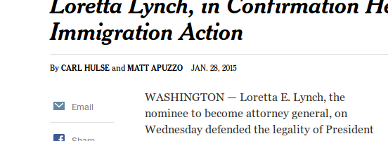
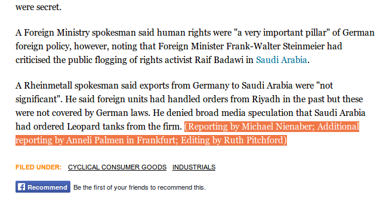

# Co-Authors Roles 
### Concepts & Scope definitions

*Problem:* The existing Co-Authors Plus plugin allows for listing multiple
authors on one article, but not for specifying the roles which those
"authors" played. This doesn't serve the needs of more complex newsrooms,
which may want to acknowledge contributors who played many different
roles: 'additional reporting', 'photography', 'supporting research', and
so on. 

Basically, we want to take something which enables data like this:

> 


> 

and make it work with output formats like these:

> 


> 


### Data Structures

- Co-Authors Plus extends the WordPress "author" structure to include
  "guest authors", which is a custom post type that is treated in the same
  way as WordPress's Users in that the WordPress functions which deal with
  authors are extended so that Guest Authors can be set as an author on
  a post in the same way as Users. This data structure will not be
  changed.

- Users should be able to define a list of Contributor Roles to which
  "Co-Authors" can be assigned on a post-by-post basis, or use a set of
  predefined defaults. One of these roles must be chosen as the default or
  primary author role, which is equivalent to WP_Post->post_author on
  a standard WordPress site.  (WordPress template functions like
  `get_author()` should return the first author set in this primary role
  on a post.)

- Any number of "authors" - whether existing users or "guest author" mock
  users - can be attached to any post object with any one of these "role"
  terms, or none. (Authors set on posts without any "role" term, e.g data
  created in the existing Co-Authors Plus plugin, will default to "primary
  author" or the default role).

- Each Contributor Role term should have a predefined set of "labels" attached to
  it for display in different formats. _eg:_ 
      
      name         | name_user_role_singular | post_relationship_by
      ------------ | ----------------------- | ----------------------------------------
      Author       | Primary Author          | by %s
      Contributor  | Contributing Reporter   | Additional reporting contributed by %s
      Photography  | Photographer            | Photography by %s
      Researcher   | Supporting Research     | Supporting research by %s

  > Questions: 
  >
  > - These terms, and the labels attached to them, should be modifiable
  >   through an API similar to the WordPress functions
  >   `register_post_type()` or `register_taxonomy()`.
  > - Can a set of labels sufficent for all expected use cases be
  >   generated? If not, it may be necessary to allow the list of labels
  >   themselves to be filtered. 

- Theme templates can display this Role / "Co-Author" data in a number of
  ways, as in the following examples:
  
  * a list of credits (all contributor role relationships on the current
    post, grouped by role, with roles ordered in site-default or
    user-defined order) in an entry footer,

  * an abbreviated byline list (listing only authors with certain roles --
    "primary author" and "contributing author", for example) in an article
    header entry-meta line,
    
  * a list of all posts a given author has contributing roles on, optionally
    grouped by role, on an author archive page, whether for a WP user
    or a "guest author".
  
- All of this data should be exposed in the WP_Query API, so that queries
  like:

    ```
    // Get all posts where user ID 22 contributed photography,
    // video, or illustration:
    get_posts(
        'author' => 22,
        'role' => array( 'photography', 'video', 'artwork' ),
    );

    // Get all the posts that Alice, Bob, or Charlie (either users with
    // the nicename or guest authors with the slug) are either a
    // primary or a contributing author:
    get_posts(
        'contributor' => array( 'alice', 'bob', 'charlie' ),
        'contributor_role' => array( 'author', 'contributor' ),
    );
    ```

  can be used, and would work as would be expected.

- In addition, a query API would need to be exposed to get all of the
  coauthors of a given post. This would be written with the intent of at
  some point replacing the `get_coauthors()` functions, if and when this
  plugin can be merged into Co-Authors Plus. In the meantime, these
  functions would be shadowed with different names. Example:

    ```
    // Get all coauthors on the current post, in the 'Additional Data
    // analysis' role:
    get_coauthors(
        null, // Post ID (for back compat), or null for the current post
        array(
            'contributor_role' => 'additional-data-analysis',
        )
    );
    ```


### Display functions

The public front-end interface in Co-Authors Plus consists of a set of eight
high-level template tag functions, and a few public lower-level helper
functions for more advanced integration. 

These will need to be replaced with new template functions: the existing
functions do not have filterable output, and the type of output the
additional data we're adding here calls for would not easily map to the
output expected by WordPress's built in author-related template tags, or
to the output of Co-Authors Plus's template tags like `coauthors()` or
`coauthors_posts_links()`.

In the initial release, no additional template tags should be necessary.
Most specialized cases should be handled in themes, through
`get_coauthors()` queries and loops.


